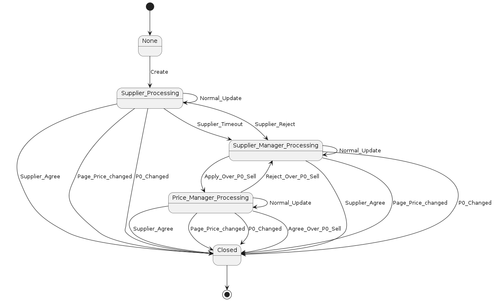
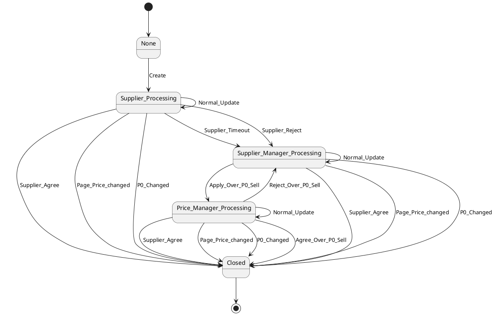

# Easy-Statemachine

一款简单易用的轻量级状态机框架。基于COLA StateMachine实现。

## 快速开始

### 入口代码

`com.openquartz.easystatemachine.builder.StateMachineBuilderFactory`

#### 1、声明

```java
StateMachineBuilderFactory.declare();
```

#### 2、指定开始状态与结束状态

```java
       StateMachineBuilder<PriceAdjustmentTaskStatusEnum, PriceAdjustmentTaskEventEnum, Context> builder =
    StateMachineBuilderFactory.<PriceAdjustmentTaskStatusEnum, PriceAdjustmentTaskEventEnum, Context>declare()
        .start(None)
        .end(Closed)
        .create();
```

#### 3、构建状态机
```java


        builder.externalTransition()
            .from(None)
            .to(Supplier_Processing)
            .on(Create)
            .when(checkCondition())
            .perform(doAction());

        // 商家调价
        Stream.of(Supplier_Processing, Supplier_Manager_Processing, Price_Manager_Processing)
            .forEach(status ->
                builder.externalTransition()
                    .from(status)
                    .to(Closed)
                    .on(Supplier_Agree)
                    .when(checkCondition())
                    .perform(doAction())
            );

        // 商家 -上升至-> 控商小二
        builder.externalTransition()
            .from(Supplier_Processing)
            .to(Supplier_Manager_Processing)
            .on(Supplier_Reject)
            .when(checkCondition())
            .perform(doAction());

        builder.externalTransition()
            .from(Supplier_Processing)
            .to(Supplier_Manager_Processing)
            .on(Supplier_Timeout)
            .when(checkCondition())
            .perform(doAction());

        // 申请申请高于P0售卖
        builder.externalTransition()
            .from(Supplier_Manager_Processing)
            .to(Price_Manager_Processing)
            .on(Apply_Over_P0_Sell)
            .when(checkCondition())
            .perform(doAction());

        // 同意高于P0价售卖
        builder.externalTransition()
            .from(Price_Manager_Processing)
            .to(Closed)
            .on(Agree_Over_P0_Sell)
            .when(checkCondition())
            .perform(doAction());

        // 拒绝高于P0价售卖
        builder.externalTransition()
            .from(Price_Manager_Processing)
            .to(Supplier_Manager_Processing)
            .on(Reject_Over_P0_Sell)
            .when(checkCondition())
            .perform(doAction());

        // 普通字段更新事件
        Stream.of(Supplier_Processing, Supplier_Manager_Processing, Price_Manager_Processing)
            .forEach(status -> builder
                .internalTransition()
                .within(status)
                .on(Normal_Update)
                .when(checkCondition())
                .perform(doAction())
            );

        // P0价变更事件、页面价高于合理价事件
        Stream.of(P0_Changed, Page_Price_changed)
            .forEach(event -> builder.externalTransitions()
                .fromAmong(Supplier_Processing, Supplier_Manager_Processing, Price_Manager_Processing)
                .to(Closed)
                .on(event)
                .when(checkCondition())
                .perform(doAction()));
```

#### 4、创建状态机
```java
    StateMachine<PriceAdjustmentTaskStatusEnum, PriceAdjustmentTaskEventEnum, Context> stateMachine =
            builder.build("AdjustPriceTask");
```

#### 5、输出状态机图
```java
stateMachine.show(Visitor.PLANT_UML);
```
得到plantuml格式的图 


#### 6、触发状态机
```java
 stateMachine.fireEvent(None, Normal_Update, new Context());
```